# 
🚀 Desafio: 30 dias de CSS

## 🎯 Objetivo

Repositório destinado aos projetos do desafio de 30 dias de CSS. O objetivo é construir 30 mini projetos, a partir do dia 27 de abril de 2021, utilizando HTML e CSS, para desenvolver as habilidades de codificação do front-end.

[Link da ideia do projeto](https://github.com/MilenaCarecho/30diasDeCSS)

## 📋 Regras

* Realizar um projeto por dia;
* Compartilhe seu progresso nas mídias sociais (Twitter, Facebook, LinkedIn etc.) usando a hashtag #30diasDeCSS;
* O projeto deve ser concluído até 23:59.

## 🖥 Projetos desenvolvidos

* [Dia 01 - Ícones de mídias sociais em camadas](#day1)
* [Dia 02 - Loader animado](#day2)
* [Dia 03 - Mudança de cor de texto quando entra em outra div](#day3)
* [Dia 04 - Botão com animação na borda](#day4)
* [Dia 05 - Botão com efeito de pulsar](#day5)
* [Dia 06 - Efeito lightning text](#day6)
* [Dia 07 - Preloader animado](#day7)
* [Dia 08 - Coração batendo](#day8)
* [Dia 09 - Pêndulo de Newton](#day9)
* [Dia 10 - Animação com texto alternando](#day10)
* [Dia 11 - Botão com efeito de preenchimento no hover](#day11)
* [Dia 12 - Efeito de preenchimento do texto ao passar o mouse](#day12)
* [Dia 13 - Loader animado](#day13)
* [Dia 14 - Background de texto animado](#day14)
* [Dia 15 - Ilustração com efeito líquido](#day15)
* [Dia 16 - Botão animado com hover e transform](#day16)
* [Dia 17 - Relógio com design de neomorfismo](#day17)
* [Dia 18 - Switch para o modo claro/escuro](#day18)
* [Dia 19 - Chat de mensagens com indicador de que alguém está digitando](#day19)
* Dia 20 - Botão com efeito
* Dia 21 - Esferas quicando
* Dia 22 - Ícones com efeito
* Dia 23 - Botão com efeito hover
* Dia 24 - Preloader animado
* Dia 25 - Checkbox animado
* Dia 26 - Loading com efeito
* Dia 27 - Efeito pulsar
* Dia 28 - Cor do background mudando
* Dia 29 - Menu responsivo com Media Queries
* Dia 30 - Fogos de artificio

### 
Ícone de mídia social em camadas

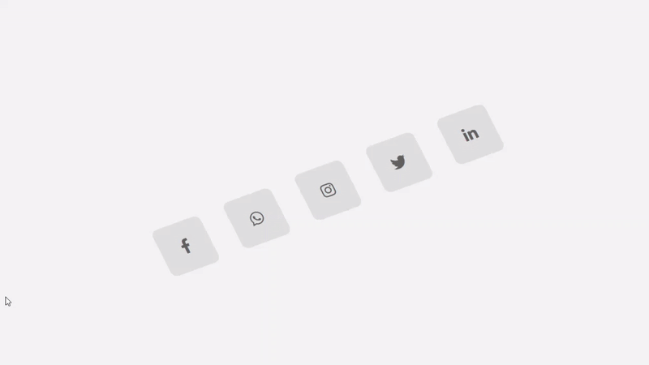

**O que aprendi:**
  * `skew()`
  * `rotate()`
  * `nth-child()`
  * Criação das camadas com a tag `` e com o `:hover`

### 
Loader animado

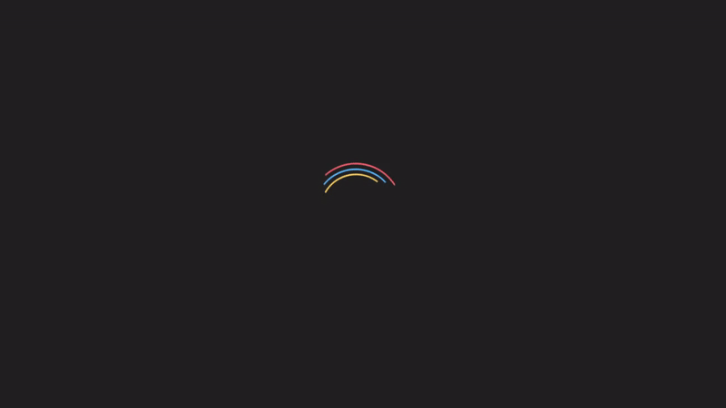

**O que aprendi:**
  * Propriedade `border-top`
  * Criação de animações

### 
Mudança de cor de texto quando entra em outra div

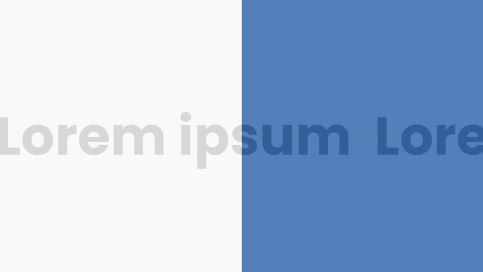

**O que aprendi:**
  * Efeito de marquee com CSS
  * Propriedade `mix-blend-mode`
  * Animação com `translateX()`

### 
Botão com animação na borda

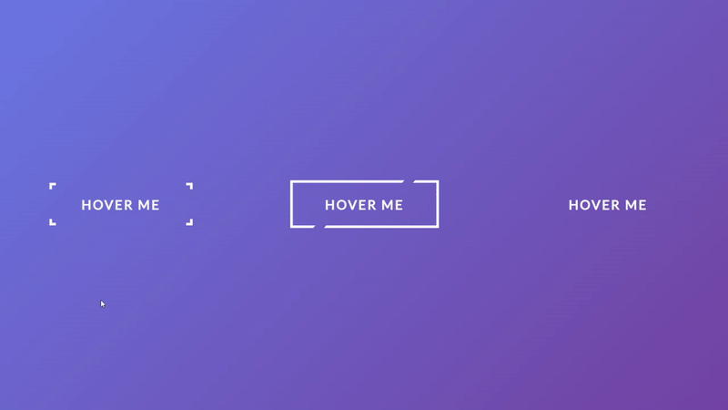

**O que aprendi:**
  * `::before` e `::after`
  * Manipular elementos SVG com as tags `<svg>` e `<rect>`
  * Propriedades CSS para manipular elementos SVG:
    * `stroke`
    * `stroke-width`
    * **`stroke-dasharray`**
    * **`stroke-dashoffset`**

### 
Botão com efeito de pulsar

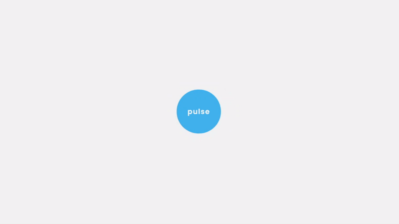

**O que aprendi:**
  * Animação com `box-shadow`

### 
Efeito lightning text

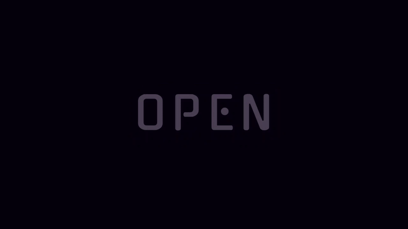

**O que aprendi:**
  * Animação com delay
  * `text-shadow`

### 
Preloader animado

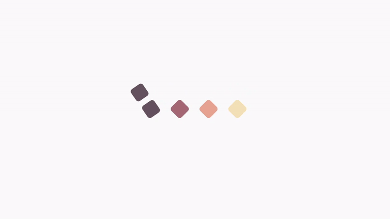

**O que aprendi:**
  * Animação com `::before` e delay
  * Porcentagem no `@keyframes`

### 
Coração batendo

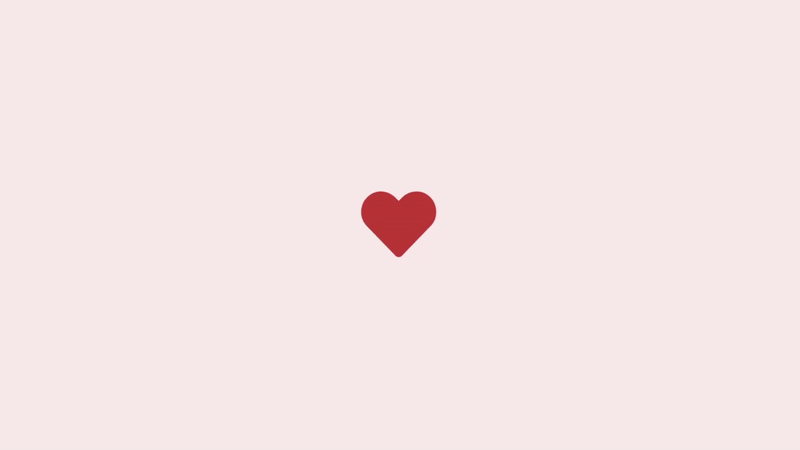

**O que aprendi:**
  * Animação com a função `scale()` da propriedade `transform` do CSS

### 
Pêndulo de Newton

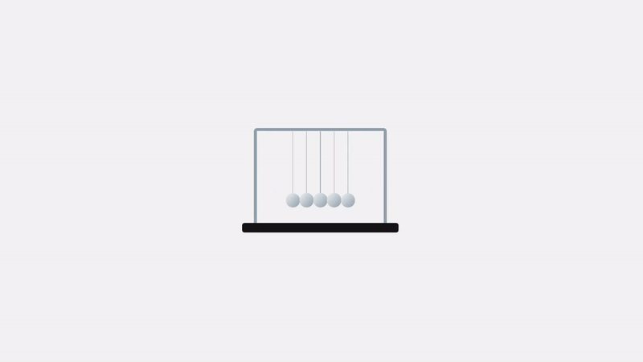

**O que aprendi:**
  * **`transform-origin`**
  * Animação com a função `rotate()`
  * `::after`

### 
Animação com texto alternando

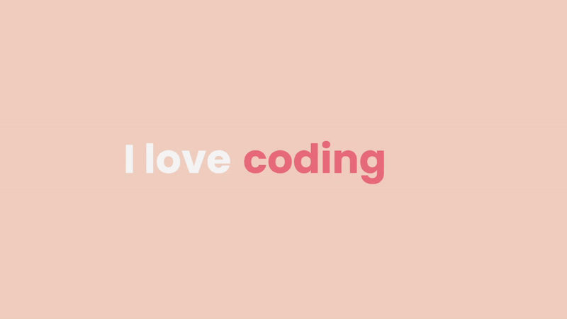

**O que aprendi:**
  * `::after`
  * Propriedade `content`

### 
Botão com efeito de preenchimento no hover

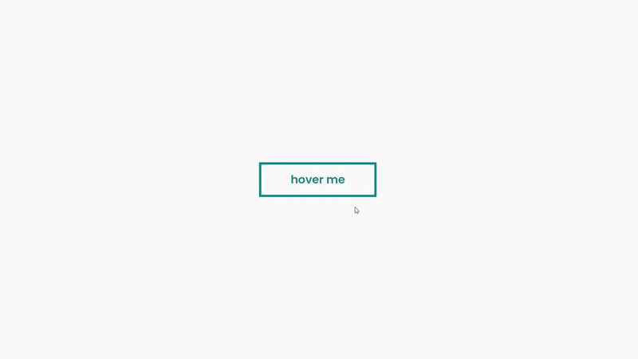

**O que aprendi:**
  * Transição no `:hover` com variação de altura do elemento `::after` 

### 
Efeito de preenchimento do texto ao passar o mouse

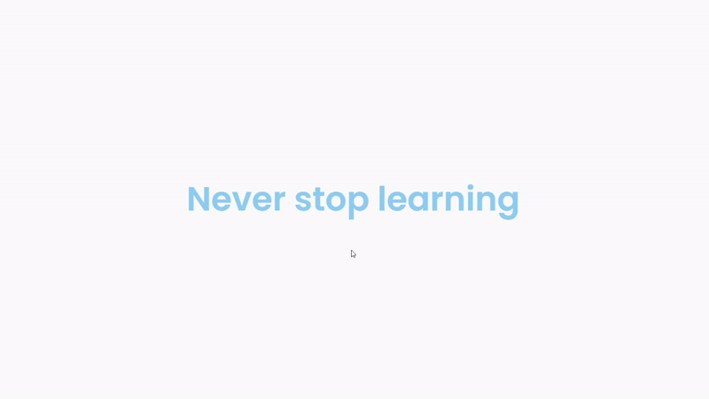

**O que aprendi:**
  * Transição no `:hover` com variação do tamanho do elemento `::after`
  * Propriedade `white-space`

### 
Loader animado

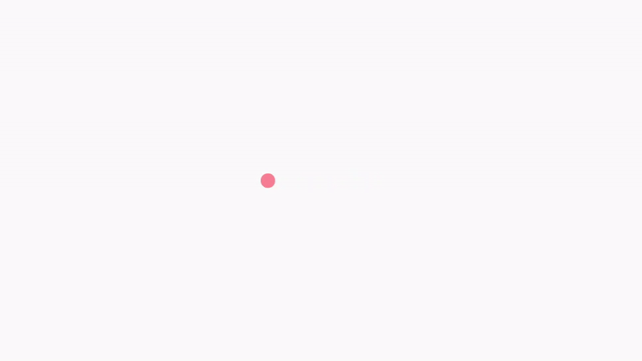

**O que aprendi:**
  * Animação com `translateX()` e `animation-delay`

### 
Background de texto animado

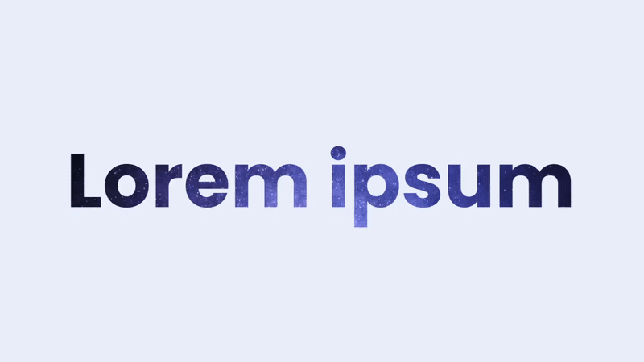

**O que aprendi:**
  * `background-clip`
  * `background-position`

### 
Ilustração com efeito líquido

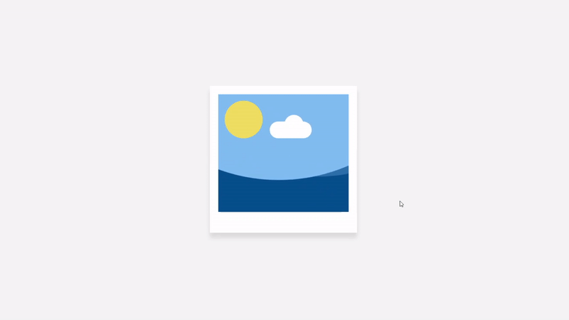

**O que aprendi:**
  * Efeito líquido utilizando `::after`, `::before`, `animation` e `transform`

### 
Botão animado com hover e transform

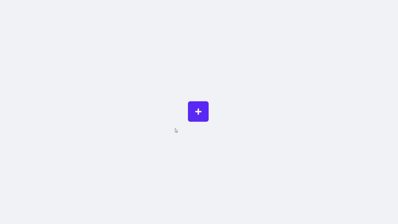

**O que aprendi:**
  * `hover`
  * Propriedade `transform` e suas funções `scale()`, `rotate()` e `translate()`

### 
Relógio com design de neomorfismo

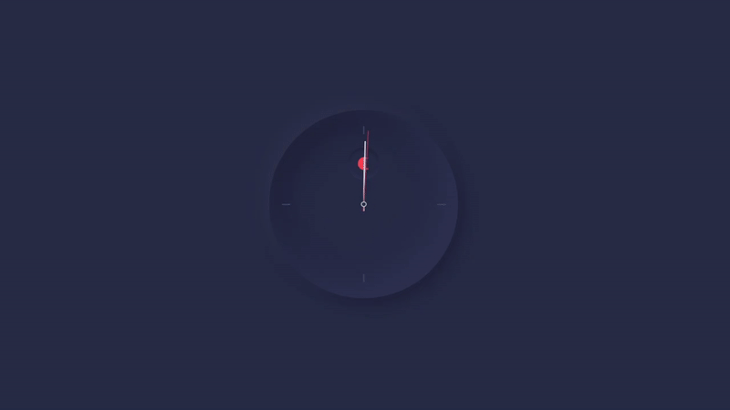

**O que aprendi:**
  * Propriedade `box-shadow` com valores negativos
  * Sombra interna (`inset`)

### 
Switch para o modo claro/escuro

**O que aprendi:**
  * Substituir estilização padrão do `input` do tipo checkbox

### 
Chat de mensagens com indicador de que alguém está digitando

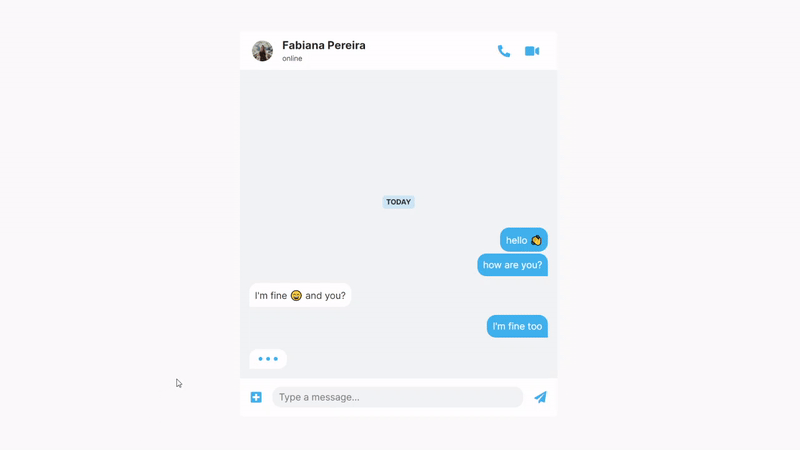

**O que aprendi:**
  * Animação com `scale()` do `transform`
  * Referência unicode de emojis no HTML

---
Em construção...